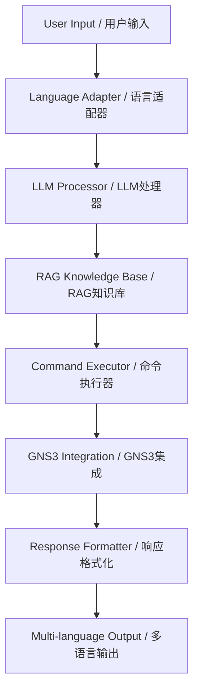

# 🌟 GNS3 Intelligent Agent / GNS3 智能代理

[](https://python.org)
[](https://langchain.com)
[](LICENSE)

> **English** | [中文文档](PROJECT_OVERVIEW.md#中文概述)

An AI-powered network device management system for GNS3 environments, featuring Large Language Models (LLM), Retrieval-Augmented Generation (RAG), and intelligent multi-language support.

一个基于AI的GNS3网络设备管理系统，集成大语言模型(LLM)、检索增强生成(RAG)和智能多语言支持。

## 📚 Documentation / 文档导航

| Document | Description | 文档说明 |
|----------|-------------|----------|
| **[🚀 QUICK_DEPLOY.md](QUICK_DEPLOY.md)** | 5-minute deployment guide | 5分钟快速部署指南 |
| **[📖 PROJECT_OVERVIEW.md](PROJECT_OVERVIEW.md)** | Complete project introduction | 完整项目介绍 |
| **[🔧 TECHNICAL_SPECS.md](TECHNICAL_SPECS.md)** | Technical specifications | 技术规格文档 |
| **[📝 README.md](README.md)** | This file - Quick reference | 本文件 - 快速参考 |

## ✨ Quick Features / 核心特性

| Feature | Description | 特性描述 |
|---------|-------------|----------|
| 🧠 **AI-Powered** | LLM integration with DeepSeek, Ollama, OpenAI | LLM集成：DeepSeek、Ollama、OpenAI |
| 📚 **RAG Enhanced** | Vector knowledge base with BGE-M3 + FAISS | RAG增强：BGE-M3嵌入 + FAISS搜索 |
| 🌍 **Multi-Language** | English-first with intelligent Chinese switching | 英文优先，智能中文切换 |
| 🛠️ **Network Management** | Complete GNS3 device configuration & analysis | 完整的GNS3设备配置和分析 |
| ⚡ **High Performance** | GPU acceleration & large file handling | GPU加速和大文件处理 |

## 🚀 Quick Start / 快速开始

```bash
# 1. Clone repository / 克隆仓库
git clone <your-repo-url>
cd GNS3/tools

# 2. Setup environment / 设置环境
pip install -r requirements.txt
python setup_rag.py --all

# 3. Configure / 配置
cp .env.example .env
# Edit .env with your settings / 编辑.env设置

# 4. Run / 运行
python main.py
```

## 💬 Usage Examples / 使用示例

### English Queries
```
🙋 You: show OSPF neighbor status
🤖 Assistant: Analyzing request...
✅ Found 1 open project(s): network_ai
🔧 Executing: show ip ospf neighbor
```

### Chinese Queries / 中文查询
```
🙋 您: 查看R1到R6的路由信息
🤖 助手: 正在分析请求...
✅ 找到 1 个打开的项目: network_ai
🔧 执行: show ip route
```

## 📁 Project Structure / 项目结构

```
📦 GNS3/tools/
├── 🎯 main.py                   # Main application / 主程序
├── ⚙️ setup_rag.py             # RAG setup / RAG设置
├── 📋 requirements.txt          # Dependencies / 依赖
├── 📂 core/                    # Core modules / 核心模块
│   ├── 🧠 intelligent_processor.py
│   ├── 🌍 language_adapter.py
│   ├── 📚 network_rag_kb.py
│   └── 🔧 rag_enhanced_executor.py
├── 📚 knowledge_base/          # RAG documents / RAG文档
├── 🗄️ vector_store/           # Vector database / 向量数据库
└── 📊 analysis_reports/        # Analysis output / 分析输出
```

## 🏗️ Architecture / 系统架构



## 🔧 Configuration / 配置

### Environment Variables / 环境变量
```bash
# GNS3 Settings / GNS3设置
GNS3_SERVER_URL=http://192.168.101.1:3080
TELNET_HOST=192.168.102.1

# LLM Settings / LLM设置
DEEPSEEK_API_KEY=your_deepseek_key
OLLAMA_BASE_URL=http://localhost:11434

# RAG Settings / RAG设置
USE_RAG=true
VECTOR_STORE_PATH=./vector_store
```

### RAG Configuration / RAG配置
```ini
[embeddings]
model_name = BAAI/bge-m3
device = cuda
max_length = 8192

[vector_store]
chunk_size = 1000
chunk_overlap = 200
search_k = 5
```

## 📚 Knowledge Base / 知识库

Support for multiple document formats / 支持多种文档格式:

- **📄 PDF**: Network troubleshooting guides / 网络排错指南
- **📝 TXT**: Command references / 命令参考
- **📓 MD**: Technical documentation / 技术文档
- **📋 DOCX**: Configuration examples / 配置示例

Simply add documents to `knowledge_base/` directory and restart the system.

只需将文档添加到 `knowledge_base/` 目录并重启系统。

## 🎯 Use Cases / 使用场景

### Network Operations / 网络运维
- Device configuration analysis / 设备配置分析
- Troubleshooting assistance / 故障排除协助
- Topology discovery / 拓扑发现
- Batch configuration collection / 批量配置收集

### Education & Training / 教育培训
- Interactive network learning / 交互式网络学习
- Command suggestion / 命令建议
- Configuration explanation / 配置解释
- Best practices guidance / 最佳实践指导

### Development & Testing / 开发测试
- Network automation scripting / 网络自动化脚本
- Configuration validation / 配置验证
- Performance analysis / 性能分析
- Integration testing / 集成测试

## 🛡️ Security & Performance / 安全与性能

### Security Features / 安全特性
- **🔐 API Key Protection**: Secure credential management / 安全凭证管理
- **🛡️ Input Validation**: Sanitized user inputs / 用户输入验证
- **🚫 Access Control**: Role-based permissions / 基于角色的权限
- **📋 Audit Logging**: Complete operation tracking / 完整操作跟踪

### Performance Optimization / 性能优化
- **⚡ GPU Acceleration**: CUDA-optimized embeddings / CUDA优化嵌入
- **🗄️ Vector Caching**: Fast similarity search / 快速相似度搜索
- **📈 Batch Processing**: Efficient multi-device operations / 高效多设备操作
- **💾 Memory Management**: Optimized for large configurations / 大配置优化

## 📖 Documentation / 文档

- **[📋 Complete Project Overview](PROJECT_OVERVIEW.md)** - Detailed feature documentation / 详细功能文档
- **[🌍 Multi-Language Guide](README_LANGUAGE.md)** - Language system documentation / 语言系统文档
- **[🧠 RAG System Guide](README_RAG.md)** - RAG configuration and usage / RAG配置和使用
- **[💻 Core Modules](core/README.md)** - Technical module documentation / 技术模块文档

## 🤝 Contributing / 贡献

We welcome contributions from the community! / 欢迎社区贡献！

1. **Fork** the repository / Fork仓库
2. **Create** a feature branch / 创建功能分支
3. **Commit** your changes / 提交更改
4. **Push** to the branch / 推送到分支
5. **Create** a Pull Request / 创建Pull Request

## 📞 Support / 技术支持

- **🐛 Issues**: [GitHub Issues](../../issues) - Bug reports and feature requests / 错误报告和功能请求
- **💬 Discussions**: [GitHub Discussions](../../discussions) - Community support / 社区支持
- **📧 Contact**: Technical support / 技术支持

## 📄 License / 许可证

This project is licensed under the **MIT License** - see the [LICENSE](LICENSE) file for details.

本项目基于 **MIT许可证** 开源 - 详见 [LICENSE](LICENSE) 文件。

---

<div align="center">

**🌟 Star this repository if you find it helpful! / 如果这个项目对您有帮助，请给个Star！🌟**

Made with ❤️ by the GNS3 Community / 由GNS3社区用❤️制作

</div>
