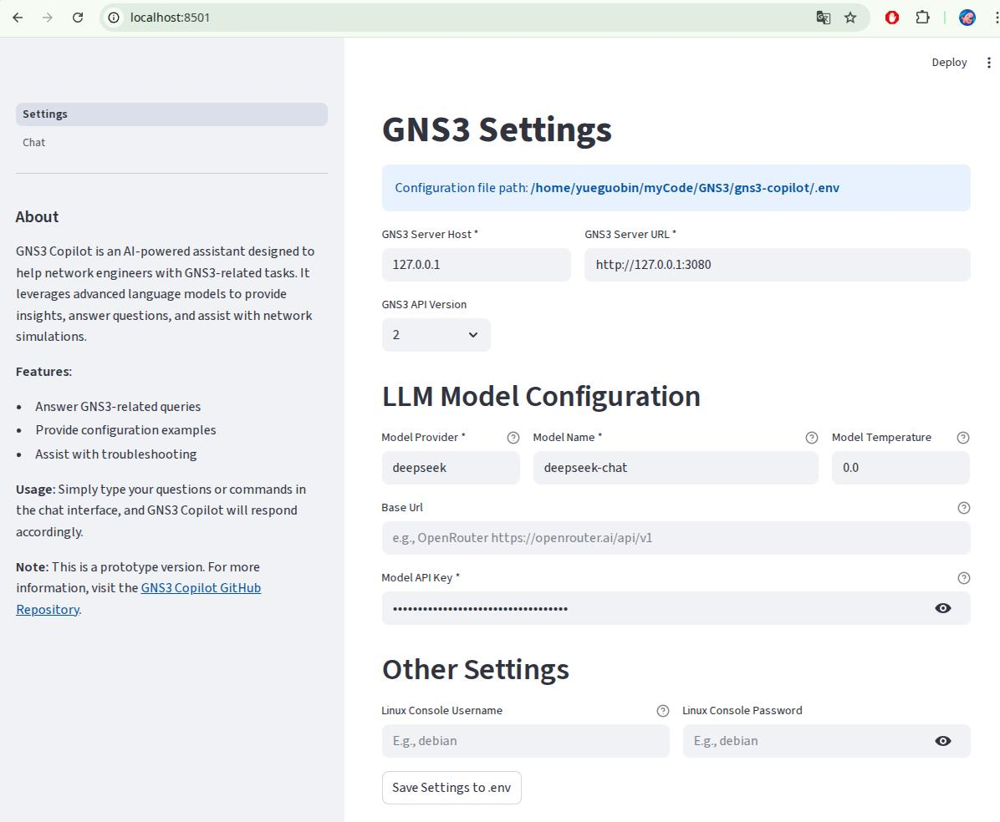

# GNS3 Copilot

An AI-powered network automation assistant designed specifically for GNS3 network simulator, providing intelligent network device management and automated operations.

## Project Overview

GNS3 Copilot is a powerful network automation tool that integrates multiple AI models and network automation frameworks. It can interact with users through natural language and perform tasks such as network device configuration, topology management, and fault diagnosis.


### Core Features

- 🤖 **AI-Powered Chat Interface**: Supports natural language interaction, understands network automation requirements
- 🔧 **Device Configuration Management**: Batch configuration of network devices, supports multiple vendor devices (currently tested with Cisco IOSv image only)
- 📊 **Topology Management**: Automatically create, modify, and manage GNS3 network topologies
- 🔍 **Network Diagnostics**: Intelligent network troubleshooting and performance monitoring
- 🌐 **LLM Support**: Integrated DeepSeek AI model for natural language processing


## Technical Architecture

### Core Components

- **Agent Framework**: Intelligent agent system built on LangChain v1.0.7 and LangGraph
- **Network Automation**: Network device automation using Nornir v3.5.0 and Netmiko v4.6.0
- **GNS3 Integration**: Custom GNS3 API client supporting topology and node management with JWT authentication capability
- **AI Models**: Supports DeepSeek Chat large language model

### Toolset

| Tool Name | Function Description |
|-----------|---------------------|
| `GNS3TopologyTool` | Read GNS3 topology information |
| `GNS3CreateNodeTool` | Create GNS3 nodes |
| `GNS3LinkTool` | Create connections between nodes |
| `GNS3StartNodeTool` | Start GNS3 nodes |
| `GNS3TemplateTool` | Get node templates |
| `ExecuteMultipleDeviceCommands` | Execute display commands |
| `ExecuteMultipleDeviceConfigCommands` | Execute configuration commands |
| `VPCSMultiCommands` | Execute VPCS commands on multiple devices |
| `LinuxTelnetBatchTool` | Execute linux commands on multiple devices |

## Installation Guide

### Environment Requirements

- Python 3.8+
- GNS3 Server (running on http://localhost:3080 or remote host)
- Supported operating systems: Windows, macOS, Linux

### Installation Steps

1. **Clone the project**
```bash
git clone https://github.com/yueguobin/gns3-copilot.git
cd gns3-copilot
```

2. **Create virtual environment**
```bash
python -m venv venv
source venv/bin/activate  # Linux/macOS
# or
venv\Scripts\activate     # Windows
```

3. **Install dependencies**
```bash
pip install -r requirements.txt
pip install .
```

1. **Start GNS3 Server**
Ensure GNS3 Server is running and can be accessed via its API interface: `http://x.x.x.x:3080`

## Usage Guide

### Startup

```bash
# Start Streamlit web interface
streamlit run app.py

# Web interface will open at http://localhost:8501
# Provides an intuitive graphical interface for interacting with the AI agent
```

### Configure on Settings Page

**Configure using First-Party Providers**



**Configure using Third-Party Aggregators**


## Security Considerations

⚠️ **Important Security Notes**:

1. **Configuration Command Security**: Configuration tools have the ability to modify device configurations, ensure before use:
   - Verify in test environment
   - Backup important configurations
   - Understand the function of each command

2. **API Key Protection**:
   - Do not commit `.env` file to version control
   - Regularly rotate API keys
   - Use principle of least privilege

3. **Network Isolation**: Recommended to use in isolated test environment

## Troubleshooting

### Common Issues

1. **GNS3 Connection Failure**
   - Check if GNS3 Server is running
   - Confirm port 3080 is accessible
   - Check firewall settings

2. **Device Connection Issues**
   - Confirm device console ports are correct
   - Check if devices are started
   - Verify Telnet connections

3. **AI Model Call Failures**
   - Check if API keys are correct
   - Confirm network connectivity
   - Verify API quotas

4. **Authentication Issues**
   - For GNS3 v3, ensure JWT tokens are properly configured (under testing)
   - Check API credentials in environment variables

### Debug Mode

Enable detailed logging:
```python
import logging
logging.basicConfig(level=logging.DEBUG)
```

## Contribution Guidelines

Welcome to contribute code! Please follow these steps:

1. Fork the project
2. Create feature branch (`git checkout -b feature/AmazingFeature`)
3. Commit changes (`git commit -m 'Add some AmazingFeature'`)
4. Push to branch (`git push origin feature/AmazingFeature`)
5. Open Pull Request

## License

This project uses MIT License - see [LICENSE](LICENSE) file for details.

## Contact

- Project Homepage: https://github.com/yueguobin/gns3-copilot
- Issue Reporting: https://github.com/yueguobin/gns3-copilot/issues

---

**Disclaimer**: This tool is for educational and testing purposes only. Before using in production environment, please thoroughly test and ensure it complies with your security policies.
