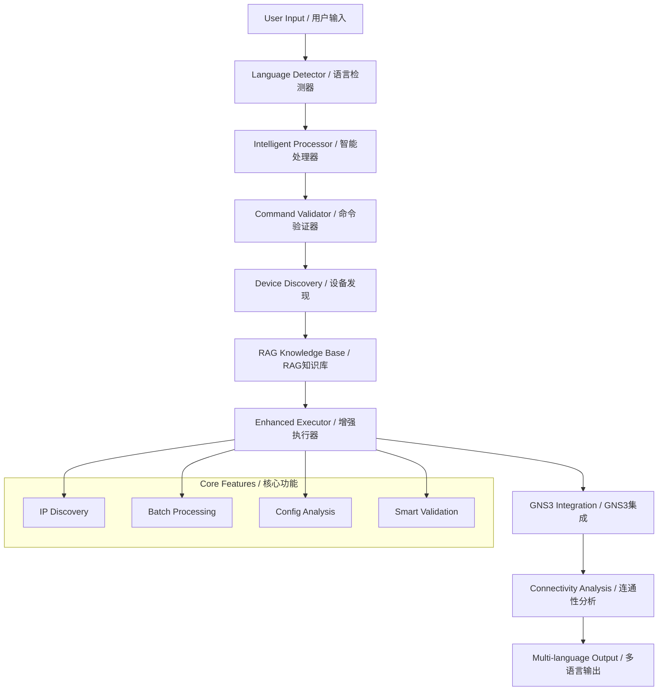

# 🌟 GNS3 Intelligent Agent

[](https://python.org)
[](https://langchain.com)
[](LICENSE)

> **English** | [中文文档](README_ZH.md)

An AI-powered network device management system for GNS3 environments, featuring Large Language Models (LLM), Retrieval-Augmented Generation (RAG), and intelligent multi-language support.

## 📚 Documentation

| Document | Description |
|----------|-------------|
| **[🚀 QUICK_DEPLOY.md](QUICK_DEPLOY.md)** | 5-minute deployment guide |
| **[📖 PROJECT_OVERVIEW.md](PROJECT_OVERVIEW.md)** | Complete project introduction |
| **[🔧 TECHNICAL_SPECS.md](TECHNICAL_SPECS.md)** | Technical specifications |
| **[🆕 ENHANCEMENTS_LOG.md](ENHANCEMENTS_LOG.md)** | Latest feature enhancements |
| **[🧪 tests/README.md](tests/README.md)** | Testing documentation |
| **[📝 README.md](README.md)** | This file - Quick reference |

## ✨ Core Features

| Feature | Description |
|---------|-------------|
| 🧠 **AI-Powered** | LLM integration with DeepSeek, Ollama, OpenAI |
| 📚 **RAG Enhanced** | Vector knowledge base with BGE-M3 + FAISS |
| 🌍 **Multi-Language** | Perfect dual-language support with auto-detection |
| 🔍 **Smart Connectivity** | Intelligent device IP discovery & connectivity analysis |
| 🛠️ **Network Management** | Complete GNS3 device configuration & analysis |
| 🎯 **Command Validation** | Advanced command verification & execution safety |
| ⚡ **High Performance** | GPU acceleration & concurrent processing |

## 🎬 Demo Video

<div align="center">

[](https://youtu.be/YNi7KF_a_k0)

**🎥 [▶️ CLICK TO WATCH DEMO VIDEO](https://youtu.be/YNi7KF_a_k0) 🎥**

*Note: Video opens in YouTube (GitHub doesn't support embedded video playback)*

</div>

**🎥 Watch the live demo** to see GNS3 Copilot in action! This video showcases:
- Real-time network device management
- AI-powered command analysis  
- Smart connectivity testing
- Bilingual interface demonstration

## 🚀 Quick Start

```bash
# 1. Clone repository
git clone <your-repo-url>
cd gns3-copilot

# 2. Setup environment
pip install -r requirements.txt
python setup_rag.py --all

# 3. Configure
cp .env.example .env
# Edit .env with your settings

# 4. Run
python main.py
```

## 💬 Usage Examples

### Smart Connectivity Analysis
```
🙋 You: ping from R1 to R2
🤖 Assistant: Analyzing connectivity request...
✅ Found project: network_ai
🔍 Discovering device IPs from configurations...
   R1: 192.168.1.1 | R2: 192.168.1.2
🔧 Executing: ping 192.168.1.2 source 192.168.1.1
📊 Analysis: Connectivity test successful
```

### Network Commands
```
🙋 You: show OSPF neighbor status on R3
🤖 Assistant: Analyzing request...
✅ Found device: R3 (Console: 5004)
🔧 Executing: show ip ospf neighbor
📋 OSPF neighbors found and analyzed
```

### Multi-Device Operations
```
🙋 You: collect configuration from all devices
🤖 Assistant: Starting batch collection...
✅ Devices: R1(5000), R2(5002), R3(5004), R4(5006), R5(5008), R6(5010)
🔧 Executing: show running-config
📁 Configurations saved to device_configs/
```

## 📁 Project Structure

```
📦 gns3-copilot/
├── 🎯 main.py                          # Main application
├── ⚙️ setup_rag.py                     # RAG setup
├── 📋 requirements.txt                  # Dependencies
├── 📂 core/                            # Core modules
│   ├── 🧠 intelligent_processor.py     # AI request analysis
│   ├── 🌍 language_adapter.py          # Dual-language support
│   ├── 📚 network_rag_kb.py            # RAG knowledge base
│   ├── 🔧 rag_enhanced_executor.py     # Enhanced command execution
│   ├── 🎯 intelligent_command_executor.py # Smart command processing
│   ├── ⚡ concurrent_command_executor.py  # Batch processing
│   └── 🔍 get_all_devices_config.py    # Device discovery
├── 📚 knowledge_base/                  # RAG documents
├── 🗄️ vector_store/                   # Vector database
├── 📊 analysis_reports/                # Analysis output
├── 🗂️ device_configs/                 # Device configurations
└── 🧪 tests/                          # Test files
    ├── test_connectivity_analysis.py   # Connectivity testing
    ├── test_english_connectivity.py    # English mode testing
    └── test_enhanced_executor.py       # Enhanced features testing
```

## 🏗️ Architecture

```mermaid
graph TD
    A[User Input] --> B[Language Detector]
    B --> C[Intelligent Processor]
    C --> D[Command Validator]
    D --> E[Device Discovery]
    E --> F[RAG Knowledge Base]
    F --> G[Enhanced Executor]
    G --> H[GNS3 Integration]
    H --> I[Connectivity Analysis]
    I --> J[Multi-language Output]
    
    subgraph "Core Features"

### English Network Commands / 英文网络命令
```
🙋 You: show OSPF neighbor status on R3
🤖 Assistant: Analyzing request...
✅ Found device: R3 (Console: 5004)
🔧 Executing: show ip ospf neighbor
📋 OSPF neighbors found and analyzed
```

### Chinese Queries / 中文查询
```
🙋 您: 检查所有路由器的路由表
🤖 助手: 正在分析请求...
✅ 找到 6 台设备: R1-R6
🔧 批量执行: show ip route
📊 路由表分析完成
```

### Multi-Device Operations / 多设备操作
```
🙋 You: collect configuration from all devices
🤖 Assistant: Starting batch collection...
✅ Devices: R1(5000), R2(5002), R3(5004), R4(5006), R5(5008), R6(5010)
🔧 Executing: show running-config
📁 Configurations saved to device_configs/
```

## 📁 Project Structure / 项目结构

```
📦 GNS3/gns3-copilot/
├── 🎯 main.py                          # Main application / 主程序
├── ⚙️ setup_rag.py                     # RAG setup / RAG设置
├── 📋 requirements.txt                  # Dependencies / 依赖
├── 📂 core/                            # Core modules / 核心模块
│   ├── 🧠 intelligent_processor.py     # AI request analysis / AI请求分析
│   ├── 🌍 language_adapter.py          # Dual-language support / 双语支持
│   ├── 📚 network_rag_kb.py            # RAG knowledge base / RAG知识库
│   ├── 🔧 rag_enhanced_executor.py     # Enhanced command execution / 增强命令执行
│   ├── 🎯 intelligent_command_executor.py # Smart command processing / 智能命令处理
│   ├── ⚡ concurrent_command_executor.py  # Batch processing / 批量处理
│   └── � get_all_devices_config.py    # Device discovery / 设备发现
├── �📚 knowledge_base/                  # RAG documents / RAG文档
├── 🗄️ vector_store/                   # Vector database / 向量数据库
├── 📊 analysis_reports/                # Analysis output / 分析输出
├── 🗂️ device_configs/                 # Device configurations / 设备配置
└── 🧪 tests/                          # Test files / 测试文件
    ├── test_connectivity_analysis.py   # Connectivity testing / 连通性测试
    ├── test_english_connectivity.py    # English mode testing / 英文模式测试
    └── test_enhanced_executor.py       # Enhanced features testing / 增强功能测试
```

## 🏗️ Architecture / 系统架构



## 🔧 Configuration

### Environment Variables
```bash
# GNS3 Settings
GNS3_SERVER_URL=http://192.168.101.1:3080
TELNET_HOST=192.168.102.1

# LLM Settings
DEEPSEEK_API_KEY=your_deepseek_key
OLLAMA_BASE_URL=http://localhost:11434

# RAG Settings
USE_RAG=true
VECTOR_STORE_PATH=./vector_store
```

### RAG Configuration
```ini
[embeddings]
model_name = BAAI/bge-m3
device = cuda
max_length = 8192

[vector_store]
chunk_size = 1000
chunk_overlap = 200
search_k = 5
```

## 📚 Knowledge Base

Support for multiple document formats:

- **📄 PDF**: Network troubleshooting guides
- **📝 TXT**: Command references
- **📓 MD**: Technical documentation
- **📋 DOCX**: Configuration examples

Simply add documents to `knowledge_base/` directory and restart the system.

## 🎯 Use Cases

### Network Operations
- Device configuration analysis
- Troubleshooting assistance
- Topology discovery
- Batch configuration collection

### Education & Training
- Interactive network learning
- Command suggestion
- Configuration explanation
- Best practices guidance

### Development & Testing
- Network automation scripting
- Configuration validation
- Performance analysis
- Integration testing

## 🛡️ Security & Performance

### Security Features
- **🔐 API Key Protection**: Secure credential management
- **🛡️ Input Validation**: Sanitized user inputs
- **🚫 Access Control**: Role-based permissions
- **📋 Audit Logging**: Complete operation tracking

### Performance Optimization
- **⚡ GPU Acceleration**: CUDA-optimized embeddings
- **🗄️ Vector Caching**: Fast similarity search
- **📈 Batch Processing**: Efficient multi-device operations
- **💾 Memory Management**: Optimized for large configurations

## 📖 Documentation

- **[📋 Complete Project Overview](PROJECT_OVERVIEW.md)** - Detailed feature documentation
- **[🌍 Multi-Language Guide](README_LANGUAGE.md)** - Language system documentation
- **[🧠 RAG System Guide](README_RAG.md)** - RAG configuration and usage
- **[💻 Core Modules](core/README.md)** - Technical module documentation

## 🤝 Contributing

We welcome contributions from the community!

1. **Fork** the repository
2. **Create** a feature branch
3. **Commit** your changes
4. **Push** to the branch
5. **Create** a Pull Request

## 📞 Support

- **🐛 Issues**: [GitHub Issues](../../issues) - Bug reports and feature requests
- **💬 Discussions**: [GitHub Discussions](../../discussions) - Community support
- **📧 Contact**: Technical support

## 📄 License

This project is licensed under the **MIT License** - see the [LICENSE](LICENSE) file for details.

---

<div align="center">

**🌟 Star this repository if you find it helpful! 🌟**

Made with ❤️ by the GNS3 Community

</div>
