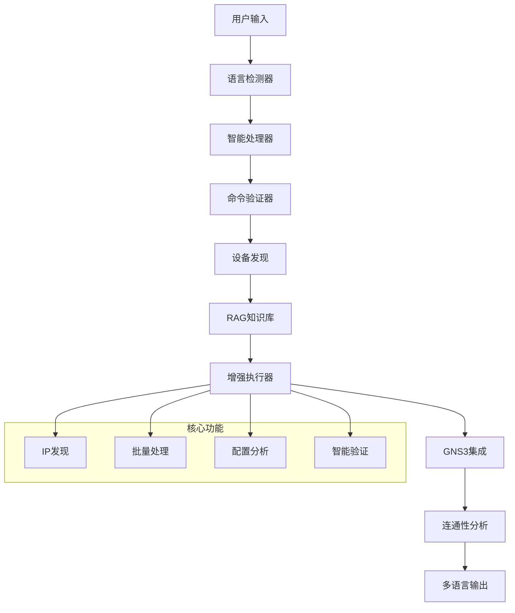

# 🌟 GNS3 智能代理

[](https://python.org)
[](https://langchain.com)
[](LICENSE)

> [English](README.md) | **中文文档**

一个基于AI的GNS3网络设备管理系统，集成大语言模型(LLM)、检索增强生成(RAG)和智能多语言支持。

## 📚 文档导航

| 文档 | 说明 |
|----------|-------------|
| **[🚀 QUICK_DEPLOY.md](QUICK_DEPLOY.md)** | 5分钟快速部署指南 |
| **[📖 PROJECT_OVERVIEW.md](PROJECT_OVERVIEW.md)** | 完整项目介绍 |
| **[🔧 TECHNICAL_SPECS.md](TECHNICAL_SPECS.md)** | 技术规格文档 |
| **[🆕 ENHANCEMENTS_LOG.md](ENHANCEMENTS_LOG.md)** | 最新功能增强记录 |
| **[🧪 tests/README.md](tests/README.md)** | 测试文档说明 |
| **[📝 README_ZH.md](README_ZH.md)** | 本文件 - 快速参考 |

## ✨ 核心特性

| 功能 | 描述 |
|---------|-------------|
| 🧠 **AI驱动** | LLM集成：DeepSeek、Ollama、OpenAI |
| 📚 **RAG增强** | BGE-M3嵌入 + FAISS搜索的向量知识库 |
| 🌍 **多语言支持** | 完美双语支持与自动检测 |
| 🔍 **智能连通性** | 智能设备IP发现与连通性分析 |
| 🛠️ **网络管理** | 完整的GNS3设备配置和分析 |
| 🎯 **命令验证** | 高级命令验证与执行安全 |
| ⚡ **高性能** | GPU加速和并发处理 |

## 🎬 演示视频

<div align="center">

[](https://youtu.be/YNi7KF_a_k0)

**🎥 [▶️ 点击观看演示视频](https://youtu.be/YNi7KF_a_k0) 🎥**

*注意：视频将在YouTube中打开（GitHub不支持嵌入式视频播放）*

</div>

**🎥 观看现场演示** 了解GNS3 Copilot的实际运行效果！视频展示：
- 实时网络设备管理
- AI驱动的命令分析
- 智能连通性测试
- 双语界面演示

## 🚀 快速开始

```bash
# 1. 克隆仓库
git clone <your-repo-url>
cd gns3-copilot

# 2. 设置环境
pip install -r requirements.txt
python setup_rag.py --all

# 3. 配置
cp .env.example .env
# 编辑.env设置

# 4. 运行
python main.py
```

## 💬 使用示例

### 智能连通性分析
```
🙋 您: 测试R1到R2的连通性
🤖 助手: 正在分析连通性请求...
✅ 找到项目: network_ai
🔍 从配置中发现设备IP...
   R1: 192.168.1.1 | R2: 192.168.1.2
🔧 执行: ping 192.168.1.2 source 192.168.1.1
📊 分析: 连通性测试成功
```

### 中文网络命令
```
🙋 您: 查看R3的OSPF邻居状态
🤖 助手: 正在分析请求...
✅ 找到设备: R3 (控制台: 5004)
🔧 执行: show ip ospf neighbor
📋 OSPF邻居已找到并分析
```

### 多设备操作
```
🙋 您: 收集所有设备的配置
🤖 助手: 开始批量收集...
✅ 设备: R1(5000), R2(5002), R3(5004), R4(5006), R5(5008), R6(5010)
🔧 执行: show running-config
📁 配置已保存到 device_configs/
```

## 📁 项目结构

```
📦 gns3-copilot/
├── 🎯 main.py                          # 主程序
├── ⚙️ setup_rag.py                     # RAG设置
├── 📋 requirements.txt                  # 依赖项
├── 📂 core/                            # 核心模块
│   ├── 🧠 intelligent_processor.py     # AI请求分析
│   ├── 🌍 language_adapter.py          # 双语支持
│   ├── 📚 network_rag_kb.py            # RAG知识库
│   ├── 🔧 rag_enhanced_executor.py     # 增强命令执行
│   ├── 🎯 intelligent_command_executor.py # 智能命令处理
│   ├── ⚡ concurrent_command_executor.py  # 批量处理
│   └── 🔍 get_all_devices_config.py    # 设备发现
├── 📚 knowledge_base/                  # RAG文档
├── 🗄️ vector_store/                   # 向量数据库
├── 📊 analysis_reports/                # 分析输出
├── 🗂️ device_configs/                 # 设备配置
└── 🧪 tests/                          # 测试文件
    ├── test_connectivity_analysis.py   # 连通性测试
    ├── test_english_connectivity.py    # 英文模式测试
    └── test_enhanced_executor.py       # 增强功能测试
```

## 🏗️ 系统架构



## 🔧 配置

### 环境变量
```bash
# GNS3设置
GNS3_SERVER_URL=http://192.168.101.1:3080
TELNET_HOST=192.168.102.1

# LLM设置
DEEPSEEK_API_KEY=your_deepseek_key
OLLAMA_BASE_URL=http://localhost:11434

# RAG设置
USE_RAG=true
VECTOR_STORE_PATH=./vector_store
```

### RAG配置
```ini
[embeddings]
model_name = BAAI/bge-m3
device = cuda
max_length = 8192

[vector_store]
chunk_size = 1000
chunk_overlap = 200
search_k = 5
```

## 📚 知识库

支持多种文档格式：

- **📄 PDF**: 网络排错指南
- **📝 TXT**: 命令参考
- **📓 MD**: 技术文档
- **📋 DOCX**: 配置示例

只需将文档添加到 `knowledge_base/` 目录并重启系统。

## 🎯 使用场景

### 网络运维
- 设备配置分析
- 故障排除协助
- 拓扑发现
- 批量配置收集

### 教育培训
- 交互式网络学习
- 命令建议
- 配置解释
- 最佳实践指导

### 开发测试
- 网络自动化脚本
- 配置验证
- 性能分析
- 集成测试

## 🛡️ 安全与性能

### 安全特性
- **🔐 API密钥保护**: 安全凭证管理
- **🛡️ 输入验证**: 用户输入验证
- **🚫 访问控制**: 基于角色的权限
- **📋 审计日志**: 完整操作跟踪

### 性能优化
- **⚡ GPU加速**: CUDA优化嵌入
- **🗄️ 向量缓存**: 快速相似度搜索
- **📈 批量处理**: 高效多设备操作
- **💾 内存管理**: 大配置优化

## 📖 文档

- **[📋 完整项目概览](PROJECT_OVERVIEW.md)** - 详细功能文档
- **[🌍 多语言指南](README_LANGUAGE.md)** - 语言系统文档
- **[🧠 RAG系统指南](README_RAG.md)** - RAG配置和使用
- **[💻 核心模块](core/README.md)** - 技术模块文档

## 🤝 贡献

欢迎社区贡献！

1. **Fork** 仓库
2. **创建** 功能分支
3. **提交** 更改
4. **推送** 到分支
5. **创建** Pull Request

## 📞 技术支持

- **🐛 问题反馈**: [GitHub Issues](../../issues) - 错误报告和功能请求
- **💬 讨论**: [GitHub Discussions](../../discussions) - 社区支持
- **📧 联系**: 技术支持

## 📄 许可证

本项目基于 **MIT许可证** 开源 - 详见 [LICENSE](LICENSE) 文件。

---

<div align="center">

**🌟 如果这个项目对您有帮助，请给个Star！🌟**

由GNS3社区用❤️制作

</div>
