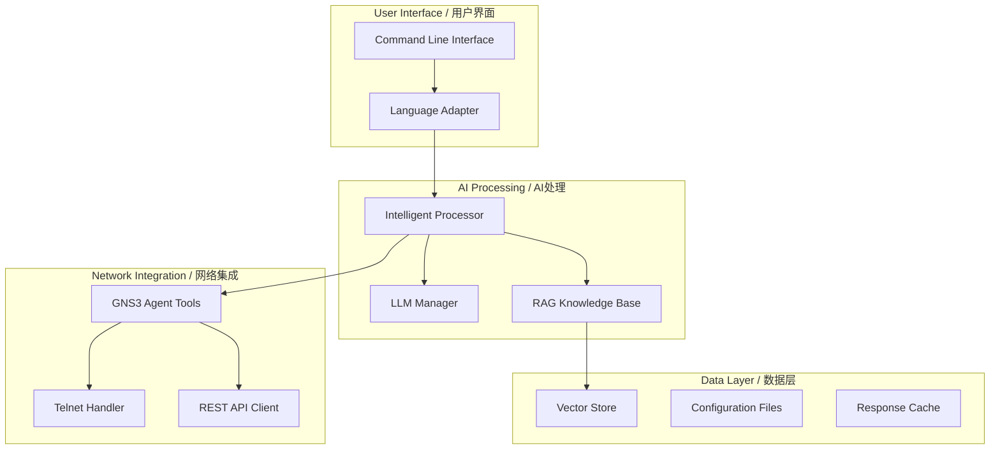

# 🔧 Technical Specifications / 技术规格

## 📊 System Requirements / 系统要求

### Minimum Requirements / 最低要求
| Component | Requirement | 组件要求 |
|-----------|-------------|----------|
| **OS** | Linux/Windows/macOS | 操作系统 |
| **Python** | 3.8+ | Python版本 |
| **RAM** | 4GB | 内存 |
| **Storage** | 2GB free space | 存储空间 |
| **Network** | GNS3 server access | 网络访问 |

### Recommended Requirements / 推荐配置
| Component | Recommendation | 推荐配置 |
|-----------|----------------|----------|
| **OS** | Ubuntu 20.04+ / Windows 11 | 操作系统 |
| **Python** | 3.11+ | Python版本 |
| **RAM** | 16GB+ | 内存 |
| **GPU** | CUDA-compatible (RTX series) | GPU |
| **Storage** | 10GB+ SSD | 存储 |
| **CPU** | 8+ cores | 处理器 |

## 🧠 AI Model Support / AI模型支持

### Supported LLM Providers / 支持的LLM提供商
```yaml
LLM Models:
  DeepSeek:
    - deepseek-chat
    - deepseek-coder
  
  Ollama:
    - llama3.1
    - qwen2.5
    - gemma2
  
  OpenAI Compatible:
    - GPT-4
    - Claude (via OpenRouter)
    - Custom endpoints
```

### Embedding Models / 嵌入模型
```yaml
RAG Embeddings:
  Primary: BAAI/bge-m3
    - Multilingual support
    - 1024 dimensions
    - GPU optimized
  
  Alternative: sentence-transformers/all-MiniLM-L6-v2
    - Lightweight
    - Fast inference
    - CPU friendly
```

## 🏗️ Architecture Details / 架构详情

### Core Components / 核心组件


### Data Flow / 数据流
```
1. User Input → Language Detection → Intent Analysis
2. Query → RAG Search → Command Selection
3. Command → GNS3 Execution → Response Collection
4. Response → LLM Processing → Formatted Output
5. Output → Language Formatting → User Display
```

## 📚 Knowledge Base Specifications / 知识库规格

### Document Processing / 文档处理
```yaml
Supported Formats:
  PDF:
    - Text extraction with PyPDF
    - Metadata preservation
    - Large file handling (>100MB)
  
  Text Files:
    - UTF-8 encoding
    - Automatic format detection
    - Line-by-line processing
  
  Markdown:
    - GitHub-flavored markdown
    - Code block preservation
    - Table extraction
  
  Word Documents:
    - DOCX format support
    - Style preservation
    - Image extraction
```

### Vector Storage / 向量存储
```yaml
FAISS Configuration:
  Index Type: IndexFlatIP
  Dimension: 1024 (BGE-M3)
  Distance Metric: Inner Product
  Storage: Local filesystem
  
Chunking Strategy:
  Chunk Size: 1000 characters
  Overlap: 200 characters
  Splitter: RecursiveCharacterTextSplitter
  
Search Parameters:
  Default K: 5 results
  Score Threshold: 0.7
  Max Results: 20
```

## 🌐 Network Protocol Support / 网络协议支持

### GNS3 Integration / GNS3集成
```yaml
API Support:
  Version: GNS3 2.2+
  Transport: HTTP/HTTPS
  Authentication: Basic/Token
  Endpoints:
    - /v2/projects
    - /v2/projects/{id}/nodes
    - /v2/projects/{id}/links
    - /v2/projects/{id}/status

Device Support:
  Cisco: IOS, IOS-XE, NX-OS
  Juniper: JunOS
  Arista: EOS
  Generic: Linux, Windows
```

### Telnet Configuration / Telnet配置
```yaml
Connection Settings:
  Port: 23 (configurable)
  Timeout: 30 seconds
  Encoding: UTF-8
  Buffer Size: 8192 bytes
  
Authentication:
  Username/Password: Supported
  Enable Password: Supported
  SSH Fallback: Available
  
Command Execution:
  Batch Processing: Yes
  Error Handling: Robust
  Output Parsing: Intelligent
```

## 🔒 Security Specifications / 安全规格

### Data Protection / 数据保护
```yaml
Encryption:
  API Keys: Environment variables
  Passwords: Masked in logs
  Configurations: Local storage only
  
Access Control:
  File Permissions: 600 for secrets
  Network Access: Configurable whitelist
  API Limits: Rate limiting support
  
Privacy:
  Data Retention: User controlled
  Logging Level: Configurable
  Sensitive Data: Automatic redaction
```

### Compliance / 合规性
- **GDPR**: Personal data handling guidelines
- **SOC 2**: Security framework compatibility
- **ISO 27001**: Information security standards
- **NIST**: Cybersecurity framework alignment

## ⚡ Performance Benchmarks / 性能基准

### Response Times / 响应时间
```yaml
Operations:
  Language Detection: <1ms
  RAG Search: 50-200ms (GPU)
  LLM Processing: 1-5s (model dependent)
  Device Configuration: 2-30s (size dependent)
  
Throughput:
  Concurrent Users: 10+
  Batch Operations: 50+ devices
  Document Processing: 1000+ pages/hour
  Vector Search: 1000+ queries/second
```

### Resource Usage / 资源使用
```yaml
Memory:
  Base Application: 500MB
  RAG Knowledge Base: 2-8GB
  LLM Model Cache: 1-4GB
  Vector Store: 100MB-2GB
  
CPU:
  Idle: 1-2% (1 core)
  Active Processing: 20-80% (multi-core)
  RAG Search: 10-30% (with GPU)
  
GPU (if available):
  VRAM Usage: 2-6GB
  Utilization: 60-90% during embeddings
  CUDA Cores: Fully utilized
```

## 📈 Scalability / 可扩展性

### Horizontal Scaling / 水平扩展
- **Multiple GNS3 Servers**: Load balancing support
- **Distributed RAG**: Multi-node vector search
- **LLM Load Balancing**: Round-robin model selection
- **Cache Clustering**: Redis-compatible caching

### Vertical Scaling / 垂直扩展
- **Memory Expansion**: Larger knowledge bases
- **GPU Scaling**: Multi-GPU embedding support
- **CPU Optimization**: Parallel processing
- **Storage Growth**: Elastic vector storage

## 🔧 Development Specifications / 开发规格

### Code Quality / 代码质量
```yaml
Standards:
  PEP 8: Python style guide
  Type Hints: Full typing support
  Docstrings: Google style
  Testing: Unit and integration tests
  
Tools:
  Linting: flake8, black
  Type Checking: mypy
  Testing: pytest
  Documentation: Sphinx
```

### API Design / API设计
```yaml
RESTful Principles:
  HTTP Methods: GET, POST, PUT, DELETE
  Status Codes: Standard HTTP codes
  Content Type: application/json
  Authentication: Bearer tokens
  
Versioning:
  URL Versioning: /api/v1/
  Backward Compatibility: 2 versions
  Deprecation Policy: 6 months notice
```

---

## 📋 Feature Matrix / 功能矩阵

| Feature | Basic | Professional | Enterprise |
|---------|-------|--------------|------------|
| **LLM Integration** | ✅ Ollama | ✅ + DeepSeek | ✅ + Custom APIs |
| **RAG Knowledge** | ✅ Basic | ✅ + GPU Acceleration | ✅ + Distributed |
| **Multi-Language** | ✅ EN/CN | ✅ + Auto-detection | ✅ + Custom Languages |
| **Device Support** | ✅ 10 devices | ✅ 100 devices | ✅ Unlimited |
| **Concurrent Users** | ✅ 1 user | ✅ 5 users | ✅ Unlimited |
| **Knowledge Base** | ✅ 100MB | ✅ 1GB | ✅ Unlimited |
| **API Access** | ❌ | ✅ Basic | ✅ Full REST API |
| **Custom Models** | ❌ | ✅ Limited | ✅ Full Support |
| **Enterprise Support** | ❌ | ❌ | ✅ 24/7 Support |

---

*Last Updated: August 2025 | 最后更新: 2025年8月*
